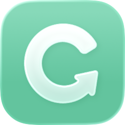

# copy

An open-source macOS clipboard manager — a faithful re-creation of [Paste](https://pasteapp.io).

> **Status: early.** A complete vertical slice works — copy is captured, stored, searched, recalled
> with ⇧⌘V, and pasted back into the app you came from. The main panel's geometry is matched to
> Paste pixel by pixel, but most of Paste's organizational features are still missing.

## Build

Requires **macOS 26+** to run, and **Xcode 26+** to build (the code uses Swift 6.2 features —
`isolated deinit` and `SWIFT_DEFAULT_ACTOR_ISOLATION`) plus
[XcodeGen](https://github.com/yonaskolb/XcodeGen) (`brew install xcodegen`).

```bash
make run
```

`Copy.xcodeproj` is generated from `project.yml` and is not checked in — edit the YAML, not the
project file.

On first launch, grant **Accessibility** permission (System Settings → Privacy & Security →
Accessibility). Without it `copy` can still put items on the clipboard, but cannot press ⌘V for you.

## Usage

| Key | Action |
|---|---|
| ⇧⌘V | Show / hide the clipboard bar |
| *(just type)* | Search — the field takes focus as soon as the panel opens |
| ← → | Move between items |
| ↩ | Paste into the previous app |
| ⇧↩ | Paste as plain text |
| ⌘1–9 | Quick paste the Nth item |
| ⌘⌫ | Delete item (plain ⌫ edits the search text) |
| esc | Dismiss |

If ⇧⌘V is already taken by another clipboard manager, `copy` falls back to ⌥⌘V and then ⌃⇧⌘V —
the combination actually in effect is shown in its menu bar menu.

Data lives in `~/Library/Application Support/Copy/`.

## Roadmap

**Working:** clipboard capture (text / rich text / link / image / file) · SQLite + FTS5 `trigram`
search that actually works for Chinese · type-to-search with full IME support · content dedup by
fingerprint · source-app attribution, including the card's accent colour taken from the app's icon ·
sensitive-content filtering · global hotkey with automatic fallback when taken · paste injection
(plus plain-text and numbered quick paste) · history retention · English and Chinese UI.

**Planned, roughly in order:**

1. **Settings window** — custom hotkey, excluded apps, retention, launch at login. Right now all
   four are hard-coded, which is the most limiting gap in daily use.
2. **Pinboards** — create, rename, drag to organize. The schema exists; the UI does nothing yet.
3. **Paste Stack** — queue several items and paste them in sequence.
4. **Image OCR** (Vision) so text inside screenshots becomes searchable.
5. Rich link previews · file thumbnails (QuickLook) · drag out to other apps · item editing and
   labels · type filters · faithful rich-text rendering.
6. Multi-display and Stage Manager handling · app icon · signed and notarized DMG plus a Homebrew
   cask.

## Privacy

Everything stays on your Mac. There is no network code in this repository. Content marked
`org.nspasteboard.ConcealedType` / `TransientType` / `AutoGeneratedType` — what password managers
use to say *don't record this* — is never stored.

## Legal

`copy` is an independent project with no affiliation to, endorsement by, or code from Paste Team ApS.
Functionality and interaction patterns are re-implemented from scratch by observing the shipping app.
No Paste trademarks, icons, or other assets are used or redistributed here — please keep it that way
in contributions.

## License

MIT
